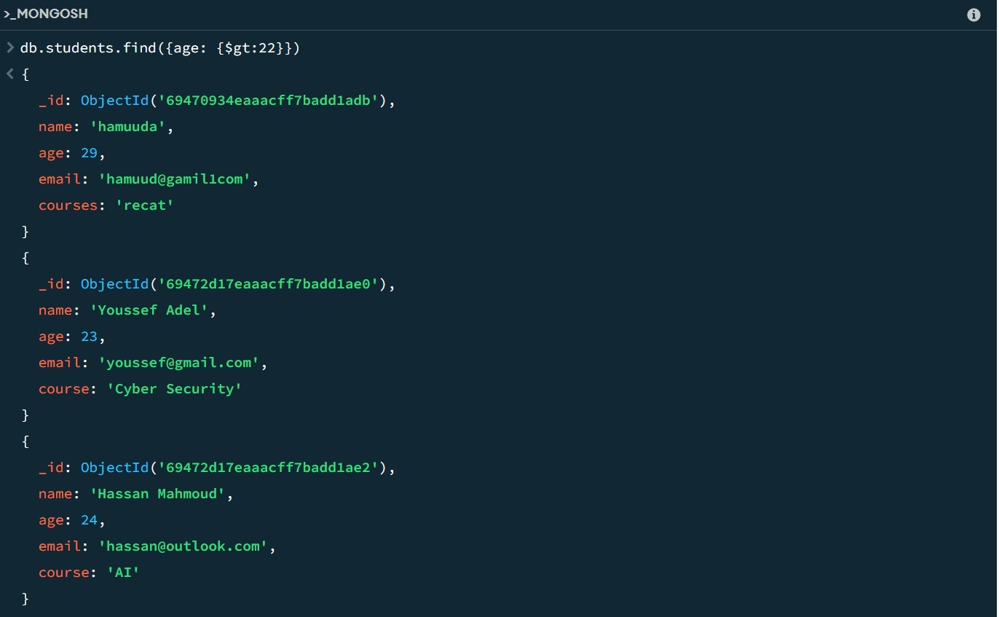
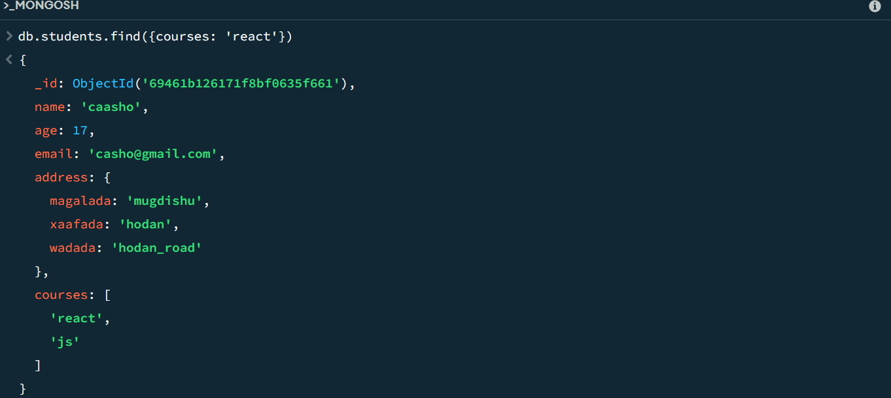
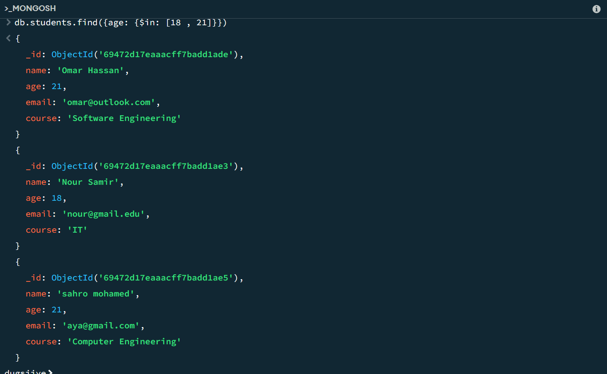
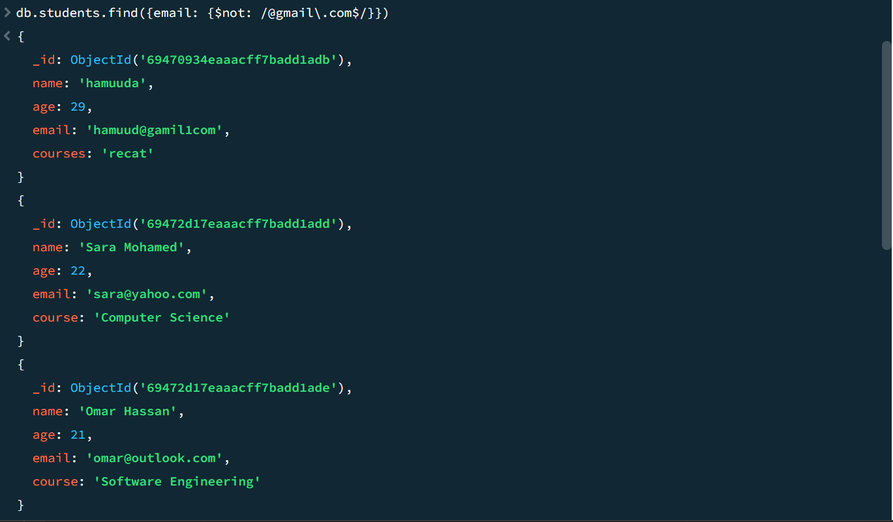
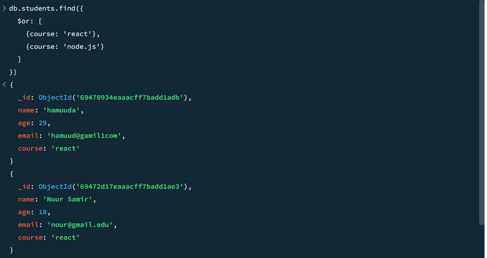
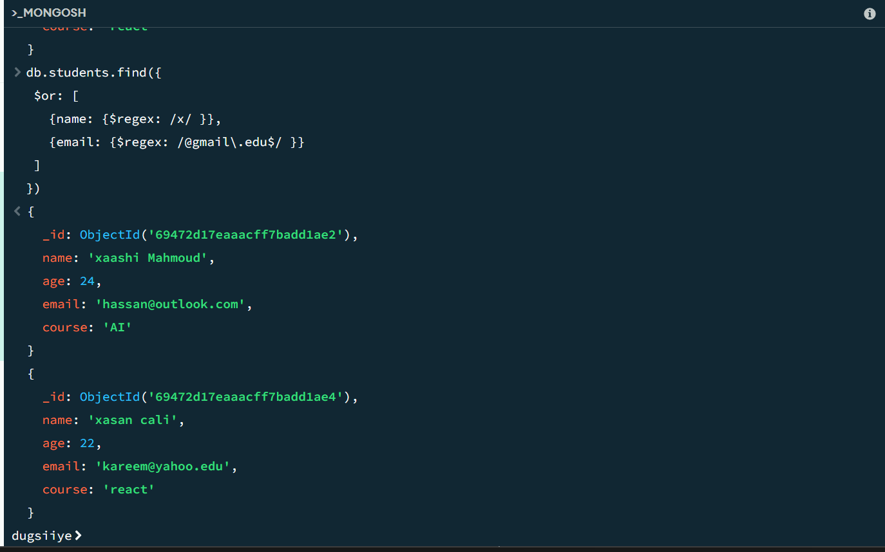

# exercise 8

### requirements

#### 1. all students older 22
``
db.students.find({age: {$gt:22}})``

result 

#### 2. students enrolled react

code ``db.students.find({age: {$gt:22}})``
result

#### 3. all students their names "s'
result 
[]

#### 4. students their age 18 or 21
result

### 5. Find students who are NOT using Gmail

 result

 ### 6. Find students enrolled in React and older than 20

 result 

 ### 7. Find students enrolled in React or Node.js
 

 ### BONUS: Use $regex to match names containing "x" or emails ending in .edu

 