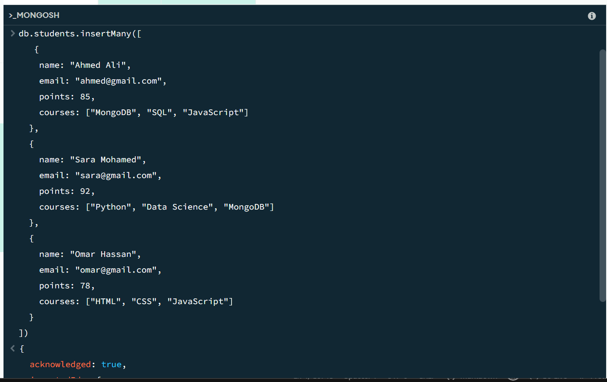
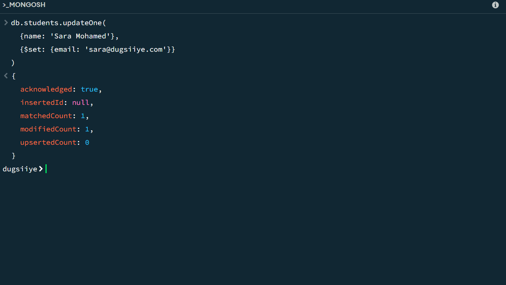
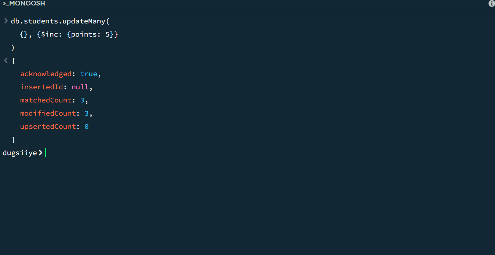
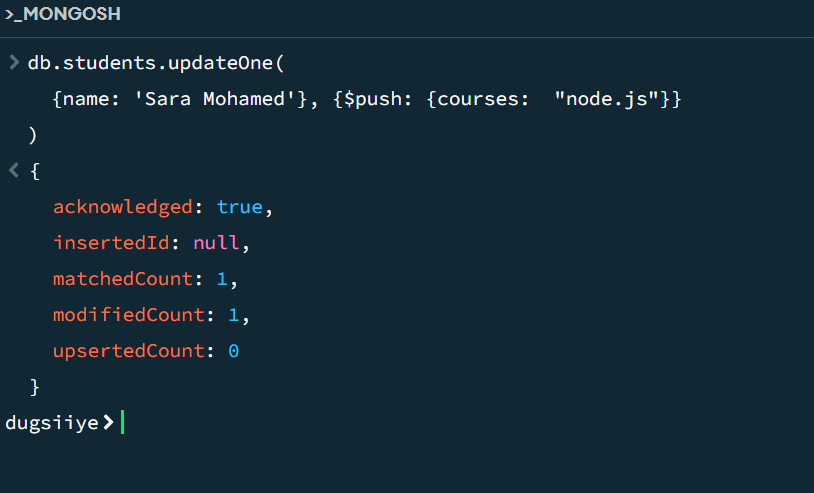
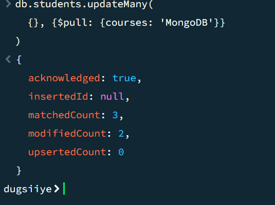
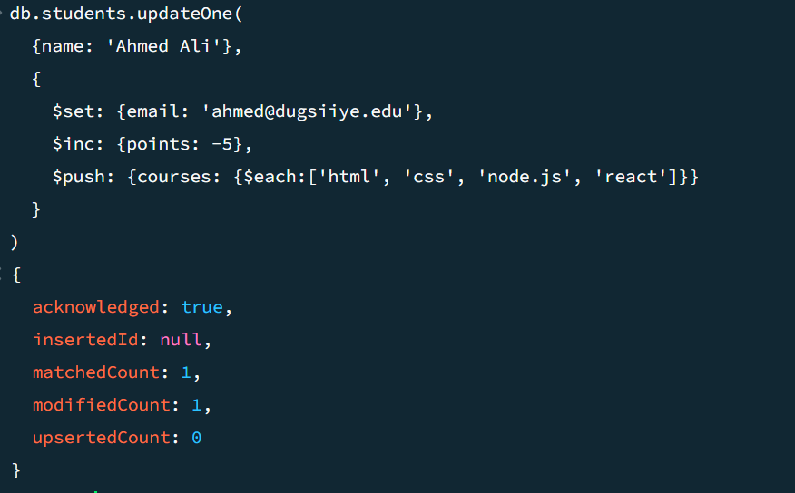

# exercise_9
### 1.  Insert 3 students with fields:

     name, email, point`, courses (array)

 result:  

 ### Use $set to update one email
 result : 

 ### Use $inc to increase points
 result: 

 ### Use $push to add a new course
 result: 

 ### Use $pull to remove a course
 result: 

 ### BONUS: Update one student with $set, $inc, and $push together

 result: 